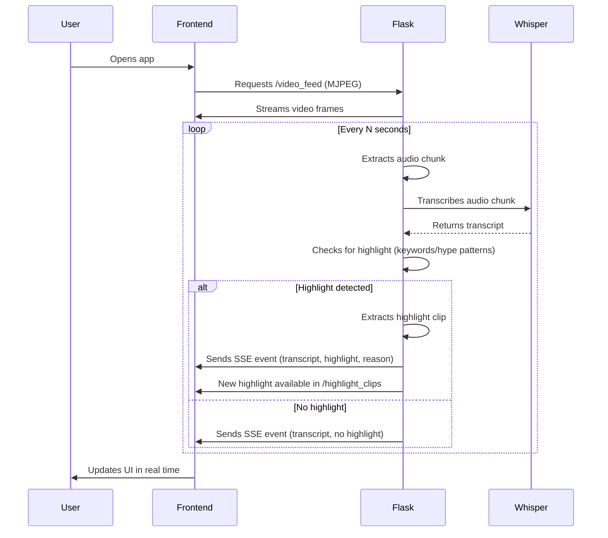

# 🏈 Real-Time Sports Highlight Detection Demo Script

---

## 1. Project Overview

- **Goal:** Automatically detect and clip exciting moments (“highlights”) from a sports video in real time, using AI (OpenAI Whisper) and display them in a modern React UI.
- **Key Features:**
  - Real-time video streaming (simulated live)
  - Whisper-based highlight detection (using both play-by-play and emotional cues)
  - Live UI updates with highlight notifications and transcript feed
  - Clean, modular backend/frontend separation

---

## 2. System Architecture Diagram

```mermaid
graph TD
    A[Video File (MP4)] -->|Frames| B[Flask Backend]
    B -->|MJPEG| C[React Frontend: Live Video]
    B -->|API: /highlight_clips| D[React Frontend: Highlights Grid]
    B -->|SSE: /notifications| E[React Frontend: Transcript Feed & Notifications]
    B -->|Audio Chunks| F[Whisper AI]
    F -->|Transcripts & Highlights| B
```

---

## 3. Live Demo Steps

### A. Start the Backend
- Activate your Python virtual environment:
  ```sh
  source venv/bin/activate
  ```
- Start the backend server:
  ```sh
  cd backend
  python3 video_stream_server.py
  ```
- The backend will:
  - Clear old highlight clips and audio chunks
  - Start streaming video and processing audio in real time

### B. Start the Frontend
- In a new terminal:
  ```sh
  cd frontend
  npm start
  ```
- The React app will open at [http://localhost:3000](http://localhost:3000)

### C. Walk Through the UI
- **Live Video Feed:** Shows the “live” stream of the sports video.
- **Transcription Feed:** Displays the latest Whisper transcript and highlights what triggered a highlight.
- **Highlights Grid:** Shows detected highlight clips as soon as they’re created.
- **Notifications:** Pop up when new highlights are detected.

---

## 4. Real-Time Highlight Detection Flow



---

## 5. Key Talking Points

- **Whisper AI**: Used for real-time transcription; detects both play-by-play and emotional cues.
- **Highlight Logic**: Combines keywords (e.g., “touchdown”, “interception”) and hype patterns (e.g., “what a catch!”, “unbelievable!”).
- **Non-blocking Design**: Video streaming and highlight detection run in separate threads for smooth playback.
- **Live UI**: Uses Server-Sent Events (SSE) for instant updates—no polling required.
- **Automatic Cleanup**: Old audio chunks and highlight clips are deleted on each startup.

---

## 6. How to Extend

- Add more sophisticated highlight logic (sentiment analysis, crowd noise, etc.)
- Support for other sports or languages
- Deploy to the cloud for remote access

---

## 7. Q&A

- “How does it know what’s a highlight?”  
  → By matching both sports terms and emotional language in the transcript.
- “Can it work with other sports?”  
  → Yes, just update the keyword and pattern lists.
- “Does it work in real time?”  
  → Yes, highlights are detected and shown as the video plays. 